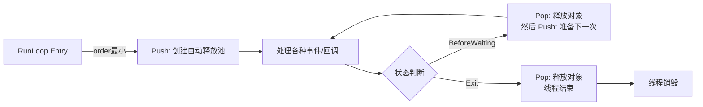

## 🔥 自动释放池（@autoreleasepool）—— 高级开发者面试必考深度解析

### 📌 面试官最想听到的三个层次

在真实面试中，面试官通常希望你从以下三个层次来回答自动释放池相关问题：

**第一层：概念层 —— 自动释放池的基本作用**
> "自动释放池是 Objective-C 中用来延迟释放对象的一种内存管理机制。它允许对象在超出作用域时不立即释放，而是在池子被销毁时统一发送 release 消息。"

**第二层：ARC 时代的现状 —— @autoreleasepool 与 NSAutoreleasePool 的区别**
> "在 ARC 模式下，NSAutoreleasePool 已被禁用，必须使用 @autoreleasepool 语法。编译器将其编译为 objc_autoreleasePoolPush 和 objc_autoreleasePoolPop 两个底层函数调用。"

**第三层：核心数据结构 —— AutoreleasePoolPage**
> "自动释放池不是一个单独的容器对象，而是通过 AutoreleasePoolPage 组成的双向链表来管理。每个 Page 大小固定为 4096 字节，除去 56 字节的元数据，第一页可存放约 504 个对象地址。"

---

### 🧱 Part 1：从 @autoreleasepool 到 objc_* 的编译转换

当我们写下以下代码时：

```objc
int main(int argc, const char * argv[]) {
    @autoreleasepool {
        NSObject *obj = [[NSObject alloc] init];
    }
    return 0;
}
```

使用 `clang -rewrite-objc main.m` 查看编译后的 C++ 代码，会发现 @autoreleasepool{} 被转换为一个结构体 __AtAutoreleasePool 的定义和使用：

```cpp
struct __AtAutoreleasePool {
    __AtAutoreleasePool() {
        atautoreleasepoolobj = objc_autoreleasePoolPush();
    }
    ~__AtAutoreleasePool() {
        objc_autoreleasePoolPop(atautoreleasepoolobj);
    }
    void * atautoreleasepoolobj;
};

int main(int argc, const char * argv[]) {
    // 在作用域开始时创建结构体变量，触发构造函数调用 push
    __AtAutoreleasePool __autoreleasepool;
    NSObject *obj = ((NSObject *(*)(id, SEL))(void *)objc_msgSend)(
        (id)((NSObject *(*)(id, SEL))(void *)objc_msgSend)(
            (id)objc_getClass("NSObject"), 
            sel_registerName("alloc")
        ), 
        sel_registerName("init")
    );
    // 作用域结束时 __autoreleasepool 变量销毁，触发析构函数调用 pop
    return 0;
}
```

**面试要点**：
- 面试官可能会追问：`__AtAutoreleasePool` 结构体的构造函数和析构函数分别在什么时候调用？
  - 构造函数：在进入 @autoreleasepool 代码块时调用（作用域开始）
  - 析构函数：在离开 @autoreleasepool 代码块时自动调用（作用域结束）
- 这体现了 C++ 对象生命周期与自动释放池生命周期的绑定关系，是 @autoreleasepool 语法糖的底层实现原理。

进一步追踪，objc_autoreleasePoolPush 和 objc_autoreleasePoolPop 实际上直接调用 AutoreleasePoolPage 类的静态方法：

```cpp
void *objc_autoreleasePoolPush(void) {
    return AutoreleasePoolPage::push();
}

void objc_autoreleasePoolPop(void *ctxt) {
    AutoreleasePoolPage::pop(ctxt);
}
```

AutoreleasePoolPage 是一个 C++ 类，定义在 Runtime 源码（objc4） 的 NSObject.mm 中：

```cpp
class AutoreleasePoolPage {
    magic_t const magic;          // 校验 page 结构完整性
    id *next;                     // 指向下一个可存放 autorelease 对象的位置
    pthread_t const thread;       // 当前 page 所属的线程
    AutoreleasePoolPage * const parent;  // 指向父节点
    AutoreleasePoolPage *child;   // 指向子节点
    uint32_t const depth;         // 链表深度，第一个 page 为 0
    uint32_t hiwat;               // 高水位标记
    // ... 其他成员
};
```

每个 page 都有自己的 parent 和 child 指针，多个 page 通过这种指针构成双向链表。page 的大小固定为 4096 字节，这与操作系统虚拟内存页的大小一致，可以减少内存碎片并提升访问效率。page 对象本身占用约 56 字节，剩余空间用来存储 autorelease 对象的地址。

**面试要点**：Page 容量计算是面试高频考点。第一页除去 56 字节的成员变量和一个 POOL_BOUNDARY（哨兵对象，8 字节），可存放 (4096 - 56 - 8) / 8 = 504 个对象地址；后续页由于无需再存储 POOL_BOUNDARY，可存放 (4096 - 56) / 8 = 505 个对象地址。

---

### 📍 Part 2：POOL_BOUNDARY —— 池边界的巧妙设计

POOL_BOUNDARY（哨兵对象）本质是一个 nil 指针，在自动释放池的实现中扮演核心角色。它的作用是**标记每个 @autoreleasepool 的边界**，当调用 pop 时，自动释放池会从最新添加的对象开始，一直释放到该 POOL_BOUNDARY 为止。

```cpp
#define POOL_BOUNDARY nil  // 哨兵对象，用来标识释放边界
```

**push 操作的详细流程**：

1. 通过 TLS 获取当前线程的 hotPage（当前正在使用的 page）
2. 检查 hotPage 是否存在：
   - **无 page**（首次调用 push）：调用 `autoreleaseNoPage(obj)` 创建第一个 page，添加 POOL_BOUNDARY，再添加对象
   - **有 page 且未满**：直接调用 `page->add(POOL_BOUNDARY)`，将哨兵添加到 next 指针指向的位置，然后 next 后移一位
   - **有 page 但已满**：调用 `autoreleaseFullPage(obj, page)` 遍历双向链表找到空闲 page 或创建新 page
3. 返回 POOL_BOUNDARY 的内存地址作为 token 保存

**pop 操作的详细流程**：

1. 接收 push 时返回的 token（POOL_BOUNDARY 的地址）
2. 通过 `pageForPointer(token)` 找到该 POOL_BOUNDARY 所在的 page
3. 调用 `releaseUntil(stop)`，从 hotPage 的 next 指针开始，逐一向后遍历：
   - 对每个对象调用 `objc_release()`
   - 直到遇到 stop 地址（即传入的 POOL_BOUNDARY 地址）为止
4. 如果某个 page 在释放后完全为空（next 指向 begin()），则将该 page 销毁并断开链表链接

```cpp
// pop 的核心逻辑（伪代码）
void AutoreleasePoolPage::pop(void *token) {
    AutoreleasePoolPage *page = pageForPointer(token);
    id *stop = (id *)token;
    page->releaseUntil(stop);  // 从 hotPage 往回 release 直到 stop

    if (page->child) {
        // 如果 hotPage 已经空了，销毁空 page
        if (page->empty()) {
            page->kill();
        }
    }
}
```

**POOL_BOUNDARY 的核心价值**：支持**自动释放池的嵌套使用**。当在一个自动释放池内创建另一个自动释放池时，push 会添加一个新的 POOL_BOUNDARY 入栈，pop 时只释放到对应的 POOL_BOUNDARY，确保外层池的对象不会提前被释放。

---

### 🚀 Part 3：hotPage 与 TLS —— 面试官可能忽略但高级面试必问的性能优化

面试官在问“AutoreleasePoolPage 如何存储和获取”时，通常希望你提到 TLS（Thread Local Storage，线程本地存储）和 hotPage 的概念。

TLS 是一种将数据与特定线程绑定的机制，每个线程维护自己独立存储空间，所有线程共享同一个 key，但 key 在不同线程中映射到不同的 value。

```cpp
// TLS 访问的实现
static inline AutoreleasePoolPage *hotPage() {
    return (AutoreleasePoolPage *)pthread_getspecific(key);
}

static inline void setHotPage(AutoreleasePoolPage *page) {
    pthread_setspecific(key, page);
}
```

**hotPage 的定义**：
- 每个线程当前正在使用的 AutoreleasePoolPage 称为 hotPage
- hotPage 通过 TLS 存储，push 时直接从 TLS 获取，时间复杂度 O(1)
- 添加对象时：先获取 hotPage，如果存在且未满则直接添加；如果满了则 hotPage 切换到下一个 page

**TLS 性能优势**：
- 每次 push/pop/autorelease 操作都需要快速获取当前 page
- 如果每次都遍历链表查找，会严重影响性能
- TLS 机制让每次访问都只需要一次线程本地内存读取，保证 O(1) 时间复杂度

---

### 🧵 Part 4：线程与 RunLoop 生命周期 —— 自动化释放池的幕后主人

自动释放池与线程**强绑定**，每个线程维护自己独立的自动释放池栈。这也是面试中的高频考点。

**主线程（默认开启 RunLoop）** ：
- App 启动后，苹果在主线程 RunLoop 里注册了两个 Observer，回调都是 `_wrapRunLoopWithAutoreleasePoolHandler()`
- **第一个 Observer**：
  - 监听事件：`kCFRunLoopEntry`（即将进入 RunLoop）
  - order 值：**-2147483647**（优先級最高，INT_MIN + 2？注意这是最小的 int 值）
  - 作用：调用 `objc_autoreleasePoolPush()` 创建自动释放池，添加 POOL_BOUNDARY
- **第二个 Observer**：
  - 监听事件：`kCFRunLoopBeforeWaiting`（准备进入休眠）和 `kCFRunLoopExit`（即将退出 RunLoop）
  - order 值：**2147483647**（优先级最低，INT_MAX - 1？注意这是最大的 int 值）
  - 作用：
    - **BeforeWaiting**：先调用 `objc_autoreleasePoolPop()` 释放旧池，再调用 `objc_autoreleasePoolPush()` 创建新池
    - **Exit**：只调用 `objc_autoreleasePoolPop()` 释放当前池



**子线程的情况**：
- 子线程的 RunLoop **默认不开启**，需要手动调用获取或创建
- **如果子线程不开启 RunLoop**：在该线程中产生的 autorelease 对象不会自动释放，可能导致内存泄漏
- **如果子线程开启了 RunLoop**：与主线程行为一致，RunLoop 会自动管理自动释放池的创建和销毁
- **子线程完全没有任何 Pool 时**：系统会在线程结束时自动释放 autorelease 对象（兜底机制）

**面试必考问答**：
> **Q**：ARC 模式下，autorelease 对象到底什么时候释放？
> **A**：
> - 如果对象位于手动创建的 @autoreleasepool 内：在离开该 pool 作用域时释放
> - 如果对象是系统自动加入池子的（主线程）：随着 RunLoop 的 BeforeWaiting 状态（即将休眠）时释放
> - 如果对象在未开启 RunLoop 的子线程中：通常在线程结束时释放（但仍建议手动添加 @autoreleasepool）

---

### 🧪 Part 5：哪些对象会进入自动释放池？

面试官常问这个问题，因为日常开发中不正确的假设可能导致内存问题。

**会自动进入池子的情况（ARC 下）** ：

1. **使用 `__autoreleasing` 修饰符的对象**：在 ARC 下，这是显式地将对象注册到自动释放池的方式

```objc
id __autoreleasing obj = [[NSObject alloc] init];
// 等价于 MRC 下的 [obj autorelease];
```

2. **非 alloc/new/copy/mutableCopy 开头的方法返回的对象**：这些方法内部实现通常调用了 autorelease

```objc
// 便利构造器内部通常实现为 autorelease
+ (instancetype)array {
    return [[[self alloc] init] autorelease];
}
```

3. **`__weak` 修饰的变量被使用时**：当使用带有 `__weak` 修饰符的变量时，该变量会被注册到 autoreleasepool 中（这是为了保证弱变量在使用过程中不会突然失效）

**不会自动入池的情况**：
- 通过 `alloc/new/copy/mutableCopy` 创建的对象：默认由 ARC 的强引用规则管理，不会自动进入池子

```objc
// 不会进入 autoreleasepool
NSObject *obj = [[NSObject alloc] init];

// 会进入 autoreleasepool
NSArray *array = [NSArray arrayWithObject:@1];
```

---

### 🎯 Part 6：性能优化 —— 循环中手动添加 @autoreleasepool

这是 iOS 开发中最常见的性能优化场景之一。

**问题场景**：

```objc
// ❌ 错误示例：内存峰值快速上涨
for (int i = 0; i < 1000000; i++) {
    NSString *str = [NSString stringWithFormat:@"%d", i];
    NSNumber *num = [NSNumber numberWithInt:i];
    // 这些对象都被 autorelase 了，但要等到 RunLoop 结束时才释放
    // 短时间内积累大量对象，内存峰值极高
}
```

**原因分析**：`stringWithFormat:`、`numberWithInt:` 等便利构造器创建的对象自动进入自动释放池，但主线程的自动释放池在 RunLoop 准备进入休眠时才释放。如果一次循环中创建了 100 万个临时对象，内存峰值会瞬间飙升。

**正确做法**：

```objc
// ✅ 正确做法：每轮循环结束后立即释放临时对象
for (int i = 0; i < 1000000; i++) {
    @autoreleasepool {
        NSString *str = [NSString stringWithFormat:@"%d", i];
        NSNumber *num = [NSNumber numberWithInt:i];
        // 处理 str 和 num...
    }  // 这里自动调用 pop，释放本轮循环的所有临时对象
}
```

**原理**：手动添加的 @autoreleasepool 在每轮循环结束时立即调用 pop，释放本批次对象，而不是等到 RunLoop 休眠或程序结束。这样内存占用始终保持在较低水平，避免峰值。

---

### 💡 Part 7：性能对比 —— @autoreleasepool vs NSAutoreleasePool

面试官可能会问：ARC 模式下为什么要用 @autoreleasepool 而不是 NSAutoreleasePool？

| 特性 | @autoreleasepool | NSAutoreleasePool |
|------|------------------|-------------------|
| ARC 兼容性 | ✅ 完全支持 | ❌ 已被禁用 |
| MRC 兼容性 | ✅ 支持（性能更好） | ✅ 支持 |
| 底层机制 | `objc_autoreleasePoolPush/Pop` | `-[NSAutoreleasePool init/drain]` |
| 内存开销 | 更小 | 更大（Objective-C 对象开销） |
| 苹果推荐 | ✅ 官方推荐（性能约快 6 倍） | ❌ 不推荐 |

**底层原因**：@autoreleasepool 直接映射到 Runtime 函数，无 Objective-C 消息发送额外开销；NSAutoreleasePool 本身是 Objective-C 对象，调用需要经过 objc_msgSend。

```objc
// MRC 环境下两种方式的对比
// 方式 1：@autoreleasepool（推荐，性能更好）
@autoreleasepool {
    NSObject *obj = [[NSObject alloc] init];
    [obj autorelease];
}

// 方式 2：NSAutoreleasePool（不推荐，性能差约 6 倍）
NSAutoreleasePool *pool = [[NSAutoreleasePool alloc] init];
NSObject *obj = [[NSObject alloc] init];
[obj autorelease];
[pool drain];
```

---

### 🎤 Part 8：经典面试题精讲

#### Q1：autorelease 对象什么时候释放？
**答案分层**（从面试官最想听到的三个层次回答）：

1. **手动创建的 @autoreleasepool**：在离开该 pool 的代码块作用域时释放
2. **系统自动创建的池子（主线程）** ：随着 RunLoop 的 BeforeWaiting（准备进入休眠）或 Exit（即将退出）状态释放
3. **子线程的情况**：如果子线程没有手动创建 @autoreleasepool 且没有开启 RunLoop，autorelease 对象在线程结束时释放（但可能已经造成内存问题）；建议在任何子线程入口处手动创建 @autoreleasepool

#### Q2：为什么在循环中需要手动添加 @autoreleasepool？
> 便利构造器等方法会将对象自动加入自动释放池。如果只有外层的 RunLoop 自动释放池，要等到 RunLoop 准备进入休眠时才释放，循环中大量临时对象会导致内存短时间内迅速升高。手动添加 @autoreleasepool 可以让每一轮循环结束时立即释放临时对象，有效控制内存峰值。

#### Q3：一个 page 最多能存多少个 autorelease 对象？
> - 每个 AutoreleasePoolPage 大小固定为 4096 字节
> - Page 元数据占用约 56 字节
> - 第一页：56 字节元数据 + 8 字节 POOL_BOUNDARY（共 64 字节），剩余 4032 字节，每个指针 8 字节，可存放 504 个对象地址
> - 后续页：无需 POOL_BOUNDARY，56 字节元数据 + 8 字节 POOL_BOUNDARY 不用再存，实际上可存 (4096 - 56) / 8 = 505 个对象地址

#### Q4：为什么每个 AutoreleasePoolPage 的大小是 4096 字节？
> 4096 是操作系统中**虚拟内存页的标准大小**。选择这个大小有两个原因：
> 1. **对齐到内存页边界**，可以减少内存碎片
> 2. **提高内存访问效率**，Page 与操作系统内存管理单元（MMU）的粒度对齐

#### Q5：autoreleasepool 可以嵌套使用吗？
> 可以。每层 @autoreleasepool 都会 push 一个 POOL_BOUNDARY 入栈，pop 时只释放到对应的 POOL_BOUNDARY。这保证了外层 pool 的对象不会因内层 pool 的 pop 而被错误释放。

---

### 📋 Part 9：面试官追问 Checklist —— 高级面试的拉分项

面试官在听完基础回答后，通常会**连续追问**来测试你的理解深度。以下追问点建议熟练掌握：

**Level 1：基础追问**

- ❓ ARC 下为什么不能用 NSAutoreleasePool？
  - 答：ARC 环境下 NSAutoreleasePool 已被禁用，编译器强制要求使用 @autoreleasepool 语法，后者性能更好（约快 6 倍）且开销更小。

- ❓ 使用 __weak 修饰的对象会被放入自动释放池吗？
  - 答：会。当使用带有 __weak 修饰符的变量时，该变量会被注册到 autoreleasepool 中，这是为了保证弱变量在使用过程中不会突然失效，从而产生野指针访问。

**Level 2：源码级追问**

- ❓ objc_autoreleasePoolPush 返回的 token 具体是什么？
  - 答：返回的是 POOL_BOUNDARY 的内存地址。这个 token 会在后续的 objc_autoreleasePoolPop 调用中作为参数传入，用于定位该池的边界位置，确保 pop 时只释放该池内部的对象。

- ❓ full() 判断方法和 next 指针的关系是怎样的？
  - 答：每个 page 维护一个 next 指针，指向下一个可存放 id 对象地址的位置。begin() 返回 page 数据区的起始地址，end() 返回数据区的结束地址。当 next == end() 时，表示该 page 已满；当 next == begin() 时，表示该 page 为空。

- ❓ 如果 hotPage 满了，新建 page 后，新 page 被设置成 hotPage 后，next 指针指向哪里？
  - 答：新 page 创建后，next 指针会初始化为该 page 的 begin() 位置，即指向数据区的第一个可用地址。然后 setHotPage(page) 将该 page 设置为新的 hotPage。后续添加 POOL_BOUNDARY 或对象时，从 begin() 位置开始存放。

**Level 3：性能与优化追问**

- ❓ 子线程中如果不加 @autoreleasepool 会怎样？
  - 答：可能会导致内存泄漏。子线程的 RunLoop 默认不开启，如果子线程中使用了便利构造器等返回 autorelease 对象的方法，这些对象没有池子可装，无法及时释放。虽然系统有兜底回收机制，但建议在任何子线程入口（如 NSThread 的入口函数、dispatch_async 的 block）处手动添加 @autoreleasepool。

- ❓ 一个线程最多能有多少个 AutoreleasePoolPage？
  - 答：没有固定上限。Page 按需动态创建，当当前 page 已满且需要继续添加 autorelease 对象时，就会通过 `new AutoreleasePoolPage(parent)` 创建新 page 并加入链表尾部。这些 page 会在释放时逐步回收（空 page 会被 kill 掉）。内存占用与同时 held 的 autorelease 对象数量成正比。

---

### 🏆 总结：高级开发者必须掌握的核心要点

| 要点 | 具体内容 |
|------|----------|
| **数据结构** | `AutoreleasePoolPage` 组成的双向链表，每个 page 大小 4096 字节 |
| **哨兵对象** | `POOL_BOUNDARY`，标记每个 @autoreleasepool 的边界 |
| **性能关键** | TLS 存储 hotPage，O(1) 访问 |
| **线程绑定** | 每个线程独立管理自己的 autorelease 对象 |
| **RunLoop 集成** | 主线程两个 Observer，Entry 时 push，BeforeWaiting/Exit 时 pop |
| **内存容量** | 第一页约 504 个对象地址，后续页约 505 个 |
| **优化场景** | 大量临时对象循环、子线程、非 UI 命令行工具 |

面试时，不仅要背出结论，更要能结合 Runtime 源码说出“**为什么是这样**”的底层原理。能讲清楚 TLS 优化、POOL_BOUNDARY 设计思想、RunLoop 两个 Observer 的 order 值含义，才是真正的高手。